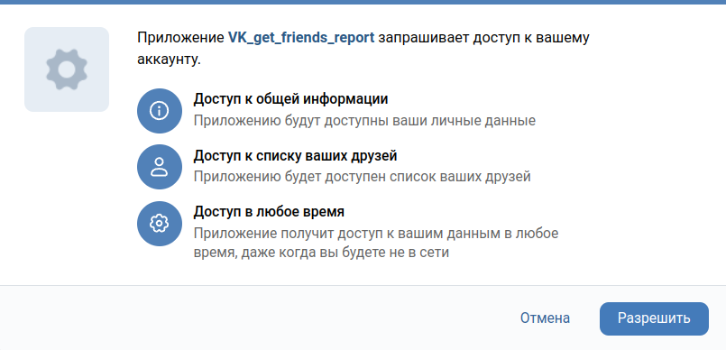
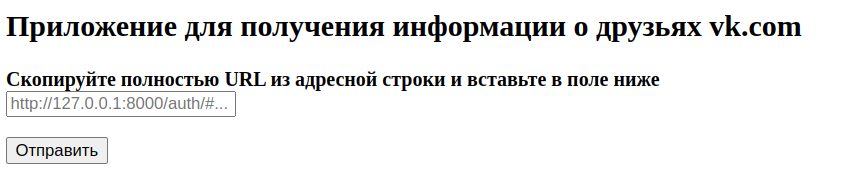
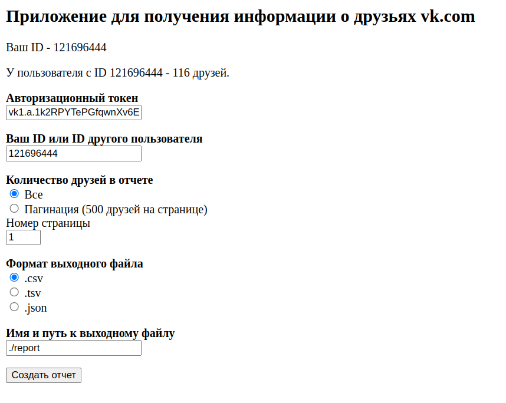
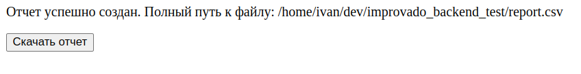

# Improvado Back-end test task for Junior Developer: VK get friends report.
___
1. Изучить API VK;
2. Разработать систему, позволяющую получить список друзей из ВКонтакте;
___
## Версия Python
>Проект разработан на версии python 3.10
___
## Установка


Создайте и активируйте виртуальное окружение
```bash
$ python3.10 -m venv venv

# Linux
$ source venv/bin/activate
# Windows
$ venv/Scripts/activate.bat
```
Установите библиотеки зависимостей из файла requirements.txt
```bash
(venv) $ pip install -r requirements.txt
```
___
## Запуск
```bash
(venv) $ python app.py
```
___
## Работа с приложением
### 1. Перейдите по ссылке `http://127.0.0.1:8000/`

### 2. Перейдите по ссылке со страницы браузера для прохождения авторизации.
*  Вас переадресует в vk.com, где приложение запросит доступ к данным с вашей страницы. Нажмите кнопку разрешить.


### 3. Страница для авторизации `auth/`
* Скопируйте полный URl из адресной строки, вставьте в форму для заполнения и нажмите кнопку отправить. 

### 4. При успешной авторизации вас переадресует на страницу выбора параметров `friends/`. 
* Поле "Авторизационный токен" заполняется автоматически и доступно только для чтения.
* Впишите в поле для заполнения "Ваш ID или ID другого пользователя" ID пользователя, друзей которого нужно получить 
в отчете (по умолчанию - ваш ID пользователя).
* Выберите количество друзей в отчете. Вы можете получить всех, что может быть долго если друзей пользователя несколько 
тысяч, либо выберите режим пагинации и выберите номер страницы, так вы сможете получать в отчете по 500 друзей.
* Выберите формат выходного файла. Вы можете получить отчет в одном из 3 доступных форматов файла: csv, tsv и json.
* В поле "Имя и путь к выходному файлу" вы можете вписать путь и имя к выходному файлу соответственно.
  (По умолчанию подставлено значение для создания файла с именем report в текущей директории)
* Нажмите кнопку "Создать отчет".
Если ID пользователя в поле "Ваш ID или ID другого пользователя" соответствует вашему ID, то отчет будет создан и вас 
переадресует на `download/`. (Если вы запросите отчет для прочего пользователя, то страница и данные о пользователе 
будут обновлены, отчет не будет создан, необходимо будет выбрать параметры отчета заново.) 

### 5. Получение отчета `download/`
* При успешном создании отчета вас переадресует на страницу `download/`
* На странице указан полный путь к файлу на вашем компьютере.
* Вы можете скачать отчет в браузере.

